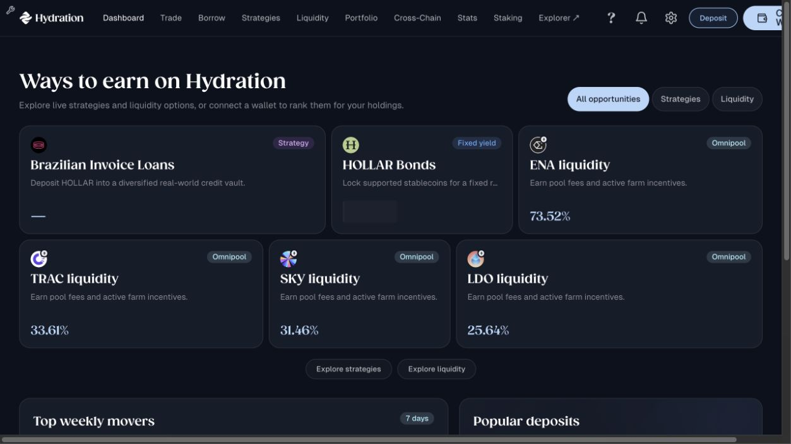

# Dashboard user-state and content map

Status: product proposal, not yet implemented

## Goal

The dashboard should answer the most useful next question for each user:

- What do I own on Hydration?
- What should I do with idle assets already on Hydration?
- How do I move useful assets from another chain to Hydration?
- How do I start if this wallet has no funds anywhere?
- What needs attention before I try to earn more?

The dashboard should infer the answer from wallet and portfolio data. Users should not have to identify themselves as a category in production.

## Key decision

Model the dashboard with two separate concepts:

1. **Base state**, where the user's useful funds currently are.
2. **Modifiers**, what deserves attention inside that base state.

This avoids creating a separate page for every combination. For example, a Hydration-funded user can also have claimable rewards, idle capital, active earning positions, debt risk, and a pending deposit.

## What the dashboard supports today

Current disconnected dashboard captured during this review:



| Current branch | Trigger today | Main content shown | Main limitation |
| --- | --- | --- | --- |
| Disconnected | `!account` | Ways to earn, top weekly movers, popular Asset Hub deposits | It is useful for discovery, but it cannot explain what the user can do with assets held elsewhere. |
| Connected overview | Manual bottom-tab selection | Portfolio overview, idle-capital matches, portfolio assets, recent transactions, all earn options | This is a layout choice, not a user state. |
| Connected Portfolio / Earn | Default manual bottom-tab selection | Portfolio, assets and activity on the left; idle-capital matches and earning opportunities on the right | This is the strongest funded-user composition and should remain the funded default. |
| Connected no-funds demo | Manual `No funds` bottom tab | Zero portfolio, empty assets/activity, a three-step starter card, general earn options | It does not detect an actually empty wallet and does not check other chains. |

Current implementation facts:

- Dashboard balances and assets come from Hydration token and ERC-20 balances only.
- The Portfolio page already has multichain balance support for Ethereum, Base, Solana, Sui, Asset Hub, and Bifrost.
- Cross-chain transfer supports additional routes, but the dashboard does not currently use those balances to choose its state.
- The current bottom switcher mixes layout options (`Overview`, `Portfolio / Earn`) with a simulated user state (`No funds`).
- `No funds` is therefore a prototype view, not a reliable classification.

## State model

### Base states

Evaluate these in order. Stop at the first confident match.

| ID | User category | Detection | Primary user need |
| --- | --- | --- | --- |
| S0 | Loading or unknown | Required balance queries are still loading, failed, or only partially completed | Understand that data is incomplete and retry safely. |
| S1 | Disconnected visitor | No selected account | Understand Hydration's value and connect or explore. |
| S2 | Funded on Hydration | Actionable Hydration balance, liquidity, bonds, staking, supply, or other positions exist | Understand the portfolio and choose the best next action. |
| S3 | Funded elsewhere only | No actionable Hydration funds, but supported external-chain assets exist | Move the right assets to Hydration with a clear route and expected outcome. |
| S4 | New or empty wallet | Hydration and all eligible external-chain checks completed successfully with no actionable funds | Fund the wallet or learn before funding. |

### Why loading and errors come first

A failed Ethereum or Asset Hub query must not classify a user as empty. Until all eligible checks are complete, show an honest partial-data state such as `We could not check Ethereum` with `Retry`, while keeping general discovery content available.

### Funded-user subtypes

These do not need separate base states. They change the order and emphasis of modules inside S2.

| Subtype | Suggested signal | Content priority |
| --- | --- | --- |
| Idle holder | Transferable matched assets exceed an agreed USD threshold | Boost idle capital first. |
| Active earner | Meaningful liquidity, bonds, farms, staking, or strategy positions | Earnings and position performance first. |
| Mixed user | Both idle and deployed capital are meaningful | Portfolio summary first, then split idle and active earning actions. |
| Trader | Recent swaps exist but earning positions are small or absent | Portfolio and recent activity first, then contextual earn suggestions. |

### Modifiers

Modifiers can appear on S2 or S3 without changing the whole layout.

| Modifier | Signal | Treatment |
| --- | --- | --- |
| Needs attention | Borrow health risk, liquidation risk, failed position, or expiring action | Place a warning and the recovery CTA before growth content. |
| Claimable rewards | Claimable value is above the display threshold | Show a compact `Claim rewards` action near portfolio earnings. |
| Pending move | Deposit, bridge, withdrawal, or swap is pending | Show progress, expected next step, and destination before other CTAs. |
| Watch-only account | Tracked or viewed account cannot sign the proposed action | Keep portfolio data visible, replace action CTAs with `Connect this wallet to act`. |
| Dust only | Positive balances exist but are below useful action thresholds | Show them in Portfolio, but do not classify the wallet as meaningfully funded. |

## Recommended content by category

### S1: Disconnected visitor

**Primary message**

`Put your assets to work on Hydration`

**Above the fold**

- Short value statement.
- Primary CTA: `Connect wallet`.
- Secondary CTA: `Explore opportunities`.
- A concise live platform overview for trust.

**Keep from the current page**

- Ways to earn.
- Top weekly movers.
- Popular deposits.

**Change**

- Popular deposits should not imply Asset Hub is the only entry route.
- Group entry routes by ecosystem: Polkadot, EVM, Solana, and Sui when available.
- Do not render empty portfolio cards for a disconnected user.

### S2A: Funded on Hydration with idle capital

This is closest to the current connected user and should keep `Portfolio / Earn` as its default composition.

**Primary message**

`You have {{idleAmount}} ready to earn`

**Left column**

1. Your portfolio overview, including claimable rewards.
2. Portfolio assets with direct Trade actions.
3. Recent transactions.

**Right column**

1. Boost idle capital, matched only to assets the user can actually deploy.
2. Ways to earn, personalized first and general discovery second.
3. Platform overview and top movers as lower-priority discovery.

**Primary CTA behavior**

- Open the existing deposit or liquidity modal when the asset is ready.
- If a route needs a prerequisite asset, explain it before sending the user elsewhere.

### S2B: Funded on Hydration and already earning

**Primary message**

`Your assets are earning on Hydration`

**Above the fold**

- Total earning balance.
- Weighted current APR or APY, only if the metric can be calculated consistently.
- Earned value for a clear time period.
- Claimable rewards.

**Main modules**

1. Active earning positions with `Manage`, `Add`, and `Claim` actions.
2. Portfolio composition.
3. Idle capital that is not yet deployed.
4. Recent transactions.
5. New opportunities, clearly separated from existing positions.

Do not lead an active earner with generic opportunity cards. Their first question is how current positions are doing.

### S2C: Funded on Hydration with a risk modifier

**Primary message**

`One position needs attention`

**Priority order**

1. Risk or recovery card with the exact affected position.
2. Repay, add collateral, retry, or complete action.
3. Portfolio overview.
4. Earning and discovery content.

Risk should outrank `Boost idle capital`. Growth messaging should not distract from a time-sensitive financial action.

### S3A: Funds on an EVM chain, none on Hydration

Supported portfolio sources currently include Ethereum and Base.

**Primary message**

`You have {{externalValue}} available on {{chainName}}`

**Primary card**

- Show the top supported assets on that chain and their values.
- Recommend the simplest eligible route to Hydration.
- Primary CTA: `Move funds to Hydration`.
- Secondary CTA: `See what you could earn`.
- Preselect source chain and source asset in Cross-Chain.
- Show estimated fees, route, and time when that data is available.

**Supporting content**

- `After moving` preview with two or three relevant earning options.
- Platform overview for trust.
- General opportunity browsing below the transfer path.

Do not show `No funds`. The user has funds, just not on Hydration.

### S3B: Funds on Asset Hub or another supported Polkadot chain

Use the same structure as S3A, but emphasize the native cross-chain route.

**Primary message**

`Bring {{assetSymbol}} from {{chainName}} to Hydration`

**Primary CTA**

`Deposit {{assetSymbol}}`

The existing Popular deposits module can become personalized here. Rank assets the user actually owns above generic popular assets.

### S3C: Funds on Solana or Sui, none on Hydration

Use the external-funded composition only when a supported inbound route exists for at least one held asset.

If balances are visible but no route is available:

- Say `We found assets on {{chainName}}, but they cannot be moved directly yet.`
- Offer a supported route only if it is real and explain the required intermediate step.
- Keep opportunity discovery available without pretending the wallet is empty.

### S4: New or genuinely empty wallet

**Primary message**

`Fund your wallet to get started`

**Primary actions**

1. `Deposit assets`.
2. `Buy or swap` only when the user can complete that path with the current wallet.
3. `Explore earning options`.

**Content order**

1. A centered wallet empty state using the existing wallet illustration and copy pattern.
2. A short funding-path chooser based on wallet ecosystem.
3. Popular starter assets and deposit routes.
4. Ways to earn, framed as planning rather than immediately actionable.
5. Platform overview and top movers.

Hide or collapse empty Recent transactions and zero-value portfolio metrics unless they help teach the next action. Repeating multiple large empty cards makes the page feel broken rather than welcoming.

### S0: Loading, partial, or failed data

**Rules**

- Keep the page structure stable with skeletons.
- Show which chain could not be checked.
- Provide `Retry` at the chain or module level.
- Never convert an error into a zero balance.
- Keep public market and earning discovery available.

## Bottom switcher proposal

The current switcher mixes page layout and simulated data state. Replace it in the prototype with a clearly labelled **Preview user state** switcher.

Recommended tabs:

1. `Live wallet`
2. `On Hydration`
3. `On another chain`
4. `New wallet`
5. `Active earner`

Behavior:

- `Live wallet` uses real connected-wallet data and automatic classification.
- The other tabs use stable mock fixtures for design review and QA.
- `On another chain` includes a chain selector inside the primary funding card instead of adding one bottom tab per chain.
- Risk, claimable rewards, pending transfers, and watch-only behavior belong in a small `Modifiers` menu, not additional primary tabs.
- On narrow screens, render this switcher as the existing small Select component.
- This switcher is a prototype and QA tool. It should not ship as user-facing production navigation.

Production navigation can continue to expose `Overview`, `Portfolio`, and `Earn` if those layouts remain useful, but it must be separate from user-state simulation.

## Suggested module inventory

Build the page from reusable modules, then reorder or configure them by state.

| Module | S1 disconnected | S2 Hydration funded | S3 external funded | S4 empty |
| --- | --- | --- | --- | --- |
| Connection/value intro | Primary | Hidden | Hidden | Hidden |
| Portfolio summary | Hidden | Primary | External summary variant | Compact zero state or hidden |
| Active earning positions | Hidden | Primary when present | Hidden | Hidden |
| Boost idle capital | Hidden | Primary when matched | `After moving` preview | Hidden |
| Move funds to Hydration | Generic routes | Secondary | Primary | Primary funding chooser |
| Recent transactions | Hidden | Show when present | External/pending moves only | Hidden |
| Claimable rewards | Hidden | Show when positive | Hidden | Hidden |
| Ways to earn | Discovery | Personalized | Context after transfer | Planning/discovery |
| Platform overview | Trust | Secondary | Trust | Trust |
| Top movers | Discovery | Secondary | Secondary | Secondary |

## Detection and data requirements

Create one derived dashboard state rather than scattering balance checks across components.

Suggested shape:

```ts
type DashboardBaseState =
  | "unknown"
  | "disconnected"
  | "hydration-funded"
  | "external-funded"
  | "empty"

type DashboardModifier =
  | "idle-capital"
  | "active-earner"
  | "needs-attention"
  | "claimable-rewards"
  | "pending-move"
  | "watch-only"
  | "dust-only"
```

Inputs:

- Connected account and whether it can sign.
- Hydration token and ERC-20 balances.
- Hydration liquidity, bonds, strategies, staking, supply, and borrow positions.
- Existing multichain portfolio balances grouped by chain.
- Query loading and error status per chain.
- Claimable rewards.
- Pending transactions and transfers.
- Recent activity.
- Opportunity eligibility by asset.

Open threshold decision:

- Keep all positive balances visible in Portfolio.
- Classify a wallet as funded only when at least one balance is actionable after existential deposit, fees, and product minimums.
- Use a small USD floor for recommendation ranking so dust does not dominate the dashboard.

## Recommended first implementation slice

1. Add a single `useDashboardUserState` derivation that combines current Hydration data with the existing multichain portfolio service.
2. Replace the manual `No funds` layout branch with automatic `external-funded` and `empty` branches.
3. Change the bottom switcher into the five-state preview tool described above.
4. Keep the current Portfolio / Earn composition as the `hydration-funded + idle-capital` fixture.
5. Add one external-funded primary card with a preselected Cross-Chain CTA.
6. Simplify the empty state to one funding card, one discovery section, and no repeated empty panels.
7. Add partial-data and retry handling before using external balances for classification.

## Acceptance criteria

- A connected user with no Hydration funds but supported external assets never sees `No funds`.
- A genuinely empty wallet sees one clear funding path before generic earning content.
- A funded Hydration user keeps the current Portfolio / Earn experience by default.
- An active earner sees current positions and rewards before generic opportunities.
- A risk state appears above growth or earning prompts.
- External query errors never become zero balances.
- Every primary CTA preserves or preselects the relevant account, chain, and asset.
- The bottom prototype switcher can reproduce every base state without changing wallets.
- Layout navigation and user-state simulation are separate concepts.

## Source references

- Dashboard composition and the current manual layout/state switcher: `apps/main/src/modules/dashboard/DashboardPage.tsx`
- Dashboard Hydration-only asset and opportunity data: `apps/main/src/modules/dashboard/DashboardPage.data.ts`
- Current dashboard copy: `apps/main/src/i18n/locales/en/dashboard.json`
- Supported multichain portfolio chains: `apps/main/src/config/portfolio.ts`
- Existing multichain balance aggregation and per-chain loading/error data: `apps/main/src/api/portfolio/multichain.ts`
- Existing external-chain portfolio rendering: `apps/main/src/modules/portfolio/overview/PortfolioOverview.tsx`
- Existing cross-chain source defaults by wallet provider: `apps/main/src/modules/xcm/transfer/utils/chain.ts`
